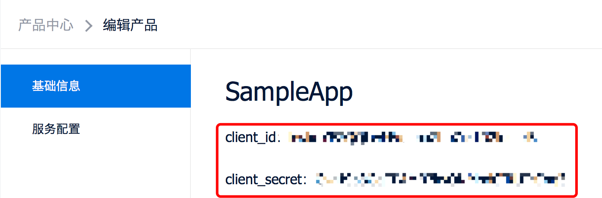
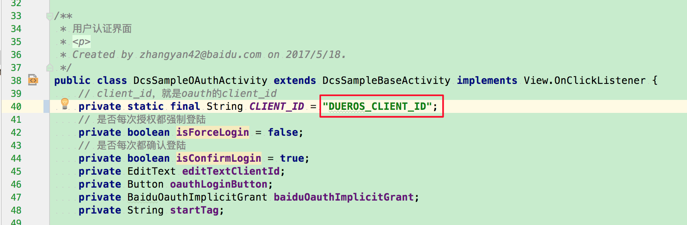
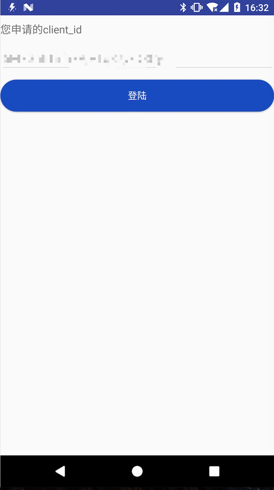
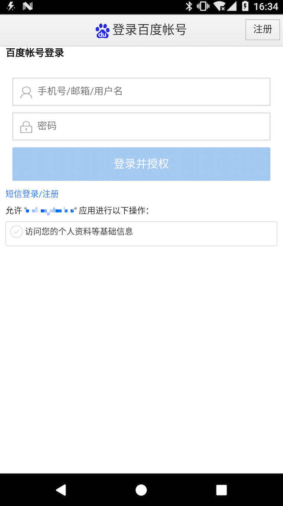
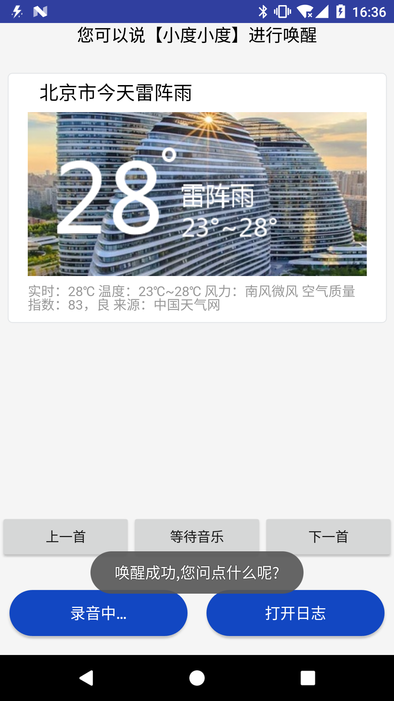
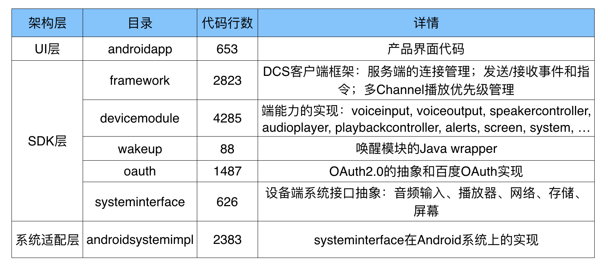
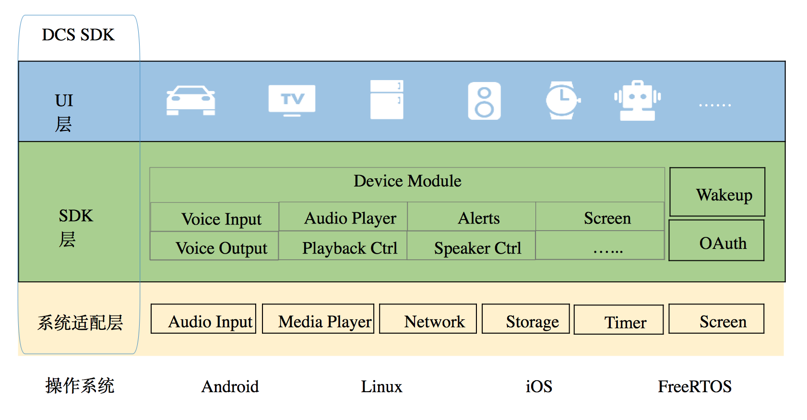

# DCS SDK（Java）开发者指南

## 声明

本开发指南为DuerOS Android DCS SDK v1.0的版本说明，该工程只做为dcs协议示例使用。本开源版本自2018-09-04起不再迭代维护。
从降低开发者接入成本、减少不可控问题出现的角度出发，DuerOS未来将主推SDK集成方案。

DuerOS DCS Android SDK v1.6.3.0及以后的版本将在百度DuerOS开放平台提供下载链接：
https://dueros.baidu.com/didp/doc/dueros-conversational-service/sdk_markdown

## DCS协议

DCS协议是DuerOS服务端与设备端之间的通讯协议，是一套把DuerOS的智能语音交互能力向所有设备开放的API，了解详情请看[DCS协议文档](http://developer.dueros.baidu.com/doc/dueros-conversational-service/introduction_markdown)。

## 摘要

DCS SDK提供DCS协议在设备端的实现，旨在降低设备接入DuerOS的开发成本。DCS SDK是完整的Sample App，可以直接在目标设备运行，并且源代码全部开源，开发者可以基于源码进行二次开发。

本文档介绍的DCS SDK（Java）是Java版本的实现，该版本目前支持Android系统。

## 1-前置条件

a.完成注册百度账号、开发者认证和产品创建（选择手机场景和Android平台）后，请保存client_id和client_secret



具体参考[控制台接入流程](http://developer.dueros.baidu.com/doc/overall/console-guide_markdown)。

b.在百度开发者中心配置OAuth的授权回调页
  1. 到DuerOS开放平台控制台： https://dueros.baidu.com/didp/product/listview
  2. 点击所创建产品的“编辑”按钮，按钮在右侧
  3. 点击OAUTH CONFIG URL，到百度开发者平台控制台
  4. 在开发者平台控制台，点击左侧“安全设置”
  5. 在“授权回调页”输入框中输入"bdconnect://cancel,bdconnect://success"（不带双引号）
  6. 点击页面下方“确定”按钮

c.开发环境
  - Android Studio 2.2+
  - Gradle 2.2+
  - Android SDK 5.0+ (支持http/2)
  - JDK 1.6+

## 2-克隆项目

```shell
git clone https://github.com/dueros/dcs-sdk-java.git
```

## 3-运行

a.通过Android Studio找到DcsSampleOAuthActivity.java，利用上述client_id进行替换

  

b.运行（Android真机）



c.百度账号登录



## 4-唤醒

说“小度小度”，成功唤醒后进入“录音中”状态，如下图：



## 5-和小度对话

a.通过唤醒或者单击“点击说话”进入录音状态， 问“北京天气怎么样”，DuerOS后端将发送stopListen指令，同时返回speak指令，播报北京天气。

b.问“播放刘若英的歌”, 返回play指令播放歌，可以从界面上进行“播放”、“暂停”、“上一首”和“下一首”操作。

## 6 SDK结构




